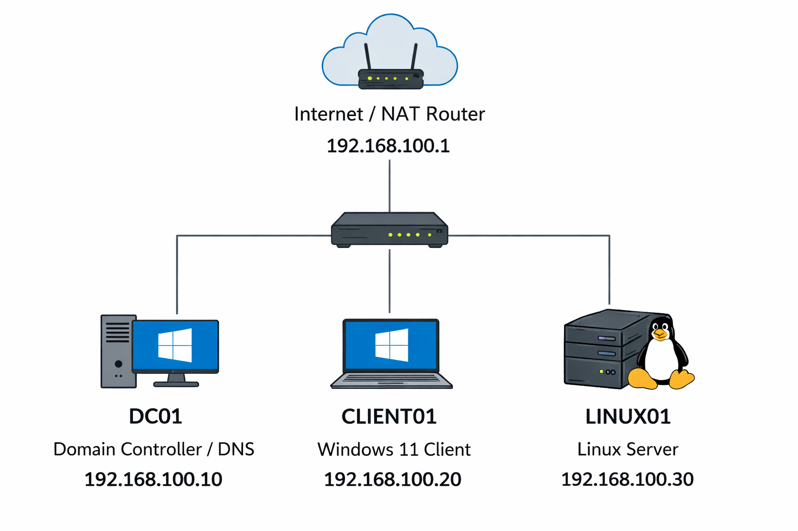

# Virtualization and Network Setup

This folder documents the base lab environment, including virtual machines, IP addresses, and network layout.  
This setup simulates a small enterprise network for practicing system administration and networking.

---

## Virtual Machines

| VM Name   | OS                  | Role                        | IP Address       |
|----------|-------------------|-----------------------------|----------------|
| DC01     | Windows Server 2022 | Domain Controller / DNS     | 192.168.100.10 |
| CLIENT01 | Windows 11         | Domain-joined client        | 192.168.100.20 |
| LINUX01  | Ubuntu Server      | Linux server / SSH access   | 192.168.100.30 |

---

## Network

- Network: 192.168.100.0/24  
- Gateway / NAT: 192.168.100.1  
- DC01 serves as the primary DNS server for all clients  
- All VMs on the same network to allow internal communication  

---

## Lab Network Diagram

> This diagram shows basic connectivity and IP assignments. Later you can replace it with a graphical diagram if desired.

---

## Notes / Best Practices

- Take a **snapshot** of each VM before starting a lab.  
- Document any changes to VM configurations in this folder.  
- Keep DNS pointing to DC01 for smooth domain operations.  
- This setup is the foundation for all labs in this repository (Active Directory, file shares, group policy, Linux administration, etc.).
